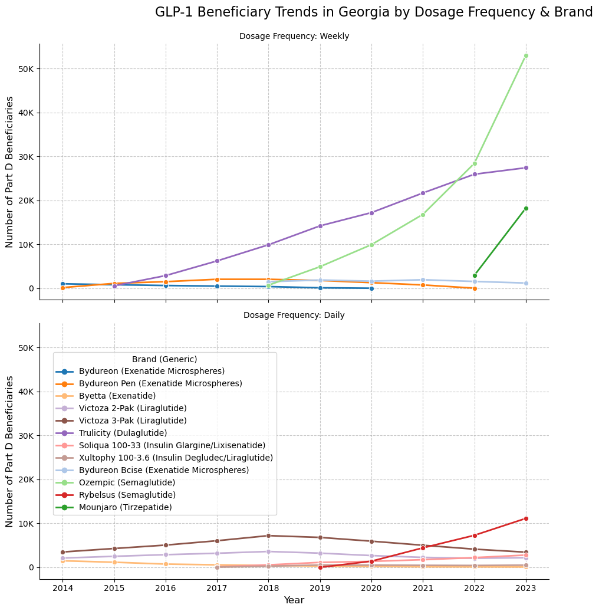
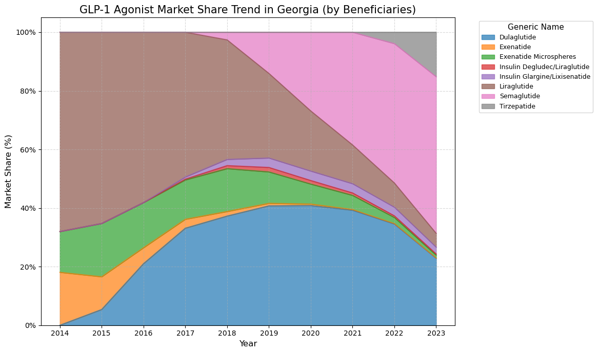

# Analysis of Medicare Part D Prescribing Trends for GLP-1 Agonists (2014-2023)

  

## 📌 Project Overview
**Objective:** To analyze the utilization patterns and associated costs of **GLP-1 Agonists** within the US Medicare Part D program over the last decade (2014-2023).

**Background:** GLP-1 agonists are a rapidly evolving class of medications for type 2 diabetes and obesity. As a **Pharmacist**, I utilized my domain expertise to interpret prescribing trends, focusing on the shift in market share due to new market entrants (Ozempic, Mounjaro) and dosage frequency preferences.

**Key Questions:**
1. How have utilization and costs changed over the last 10 years?
2. Which specific agents (Trulicity, Ozempic, Mounjaro) are driving growth?
3. Is there a correlation between **dosage frequency** (Weekly vs. Daily) and market share?

---

## 📂 Data Source & Access
**Source:** 
[CMS Medicare Part D Prescribers - by Geography and Drug](https://data.cms.gov/provider-summary-by-type-of-service/medicare-part-d-prescribers/medicare-part-d-prescribers-by-geography-and-drug)

[Data.gov Medicare Part D Prescribers - by Geography and Drug](https://catalog.data.gov/dataset/medicare-part-d-prescribers-by-geography-and-drug-d1df1) Alternative

> **⚠️ Note on Data Access:**
> Due to the large file size, the raw CSV files are **not included** in this repository. To run the notebook:
> 1. Download the csv datasets (2014-2023) from the CMS link above.
> 2. Create a folder named `Raw Data CSV` in the root directory.
> 3. Place the downloaded CSV files into that folder.

---

## 📊 Key Findings

### 1. Explosive Growth of Weekly Injectables
The analysis reveals a dramatic market shift from daily injections (e.g., Victoza, Byetta) to **once-weekly formulations** (e.g., Trulicity, Ozempic).
* **Insight:** Convenience drives adherence. The data shows a clear preference among Medicare beneficiaries for weekly regimens.

### 2. The Rise of Semaglutide & Tirzepatide
**Ozempic (Semaglutide)** and **Mounjaro (Tirzepatide)** have shown the most significant growth rates since their launch, rapidly capturing market share in Georgia and nationwide.

### 3. PharmD Insight: The Exception (Exenatide)
Despite being a weekly formulation, **Bydureon (Exenatide ER)** has not seen comparable growth.
* **Clinical Interpretation:** This likely reflects clinical guidelines favoring newer agents (Semaglutide/Tirzepatide) due to their superior efficacy in **A1C reduction** and **weight loss** compared to Exenatide. This demonstrates that while convenience (frequency) is important, **clinical efficacy** remains the primary driver of prescribing habits.

---

## 🛠 Tech Stack
* **Language:** Python
* **Libraries:** Pandas (Data Cleaning & Aggregation), Matplotlib & Seaborn (Visualization)
* **Key Techniques:**
    * **Batch Processing:** Implemented a loop with **Regex** to dynamically identify and load 10 years of CSV data, handling inconsistent file naming conventions.
    * **Data Cleaning:** Handled CMS suppression codes (Null values) by statistically safe imputation (filling with 0) rather than mean imputation.
    * **Domain Mapping:** Created a dictionary mapping Brand Names to Dosage Frequencies based on pharmacological knowledge.

---

## ⚠️ Limitations
1. **Data Period:** Covers up to 2023; 2024 data was unavailable at the time of analysis (April 2025).
2. **Population:** Specific to Medicare Part D beneficiaries; trends may differ in commercial insurance populations (e.g., younger demographics using GLP-1s for weight loss).
3. **Data Granularity:** The dataset is aggregated by drug/state, lacking patient-level details (e.g., specific indication for Diabetes vs. Obesity).

---

## 🚀 How to Run
1. Clone this repository.
2. Install dependencies: `pip install -r requirements.txt`
3. Download raw data from CMS and place it in `Raw Data CSV/`.
4. Run the Jupyter Notebook `GLP1_Medicare_Analysis.ipynb`.
